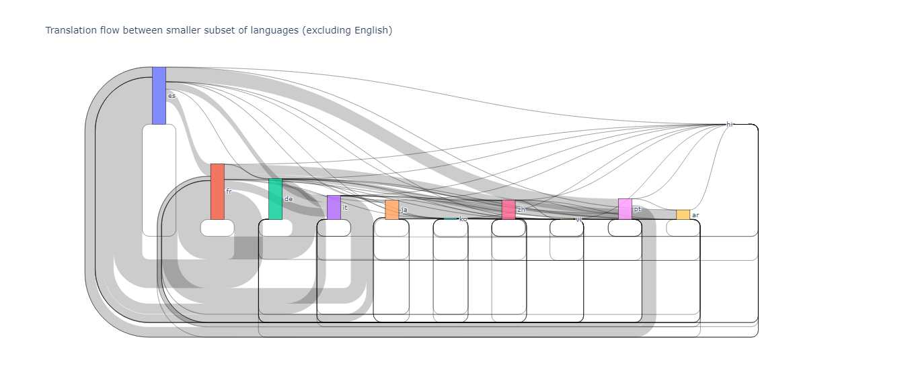
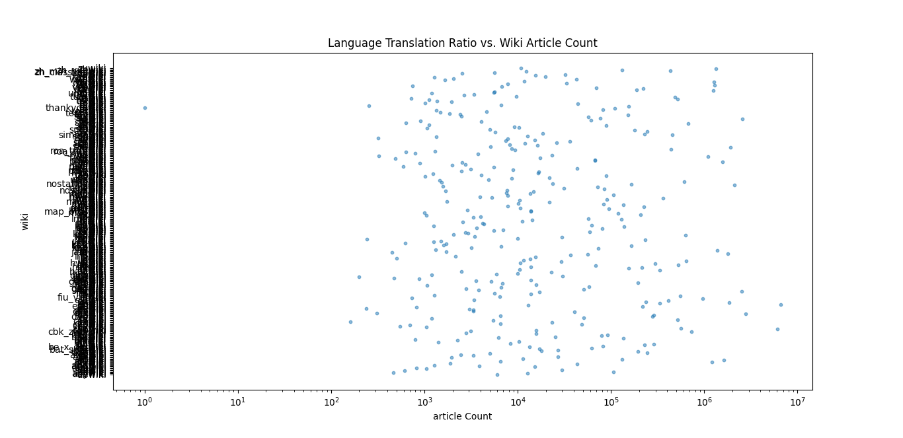

# flow-diagrams-illustrating-translation-imbalances
This repository is my contribution to task #T331204.

# Sankey Diagram
Using the public Content Translation data source as a reference, I wrote Python code to generate a Sankey diagram that displays the translation relationships between several languages, such as Spanish, Italian, French, Japanese, Korean, Vietnamese, Chinese, Portuguese, Arabic, and hindi. I refined and extended the illustration to highlight additional details and intriguing imbalances or balances in translation. This is the link to the live sankey diagram.

# Scatter Plot Diagram
Furthermore, I attempted to create a scatter plot diagram using Python code to retrieve translation data from the Wikipedia API and visualize the number of translations between different languages. The scatter plot diagrams are based on the ratio of translations from one language to another, providing a clear visualization of the relationships between various languages.

also I attempted to create another scatterplot diagram of the translation ratio against the Wikipedia article count for different languages.Using the csv file provided by my mentor to visualize the relationship between the language translation ratio and the number of Wikipedia articles.
 
## Usage
### To generate the Sankey diagram, follow these steps:

1. Clone the repository.
2. Install the required Python packages using pip install 
3. Run the sankey_diagram.py file using python sankey_diagram.py.
4. The generated Sankey diagram will be saved in the sankey_diagram.html file.

## Scatterplot Diagrams
The scatterplot diagrams are generated using the Wikipedia API to retrieve translation data and create scatterplots to visualize the number of translations between different languages. The Python code for generating the diagrams is included in the scatterplot_diagram.py file. The project also attempted to create a scatterplot diagram of the translation ratio against the Wikipedia article count for different languages, but this was not possible due to the lack of available data.

## Usage
To generate the scatterplot diagrams, follow these steps:

1. Clone the repository.
2. Install the required Python packages using pip install 
3. Run the scatterplot_diagram.py file using python scatterplot_diagram.py.
4. The generated scatterplot diagrams will be saved in the scatterplot_diagram.png file.

## Contributors
Anshika Bhatt

## License
This project is licensed under the MIT License - see the LICENSE.md file for details.

